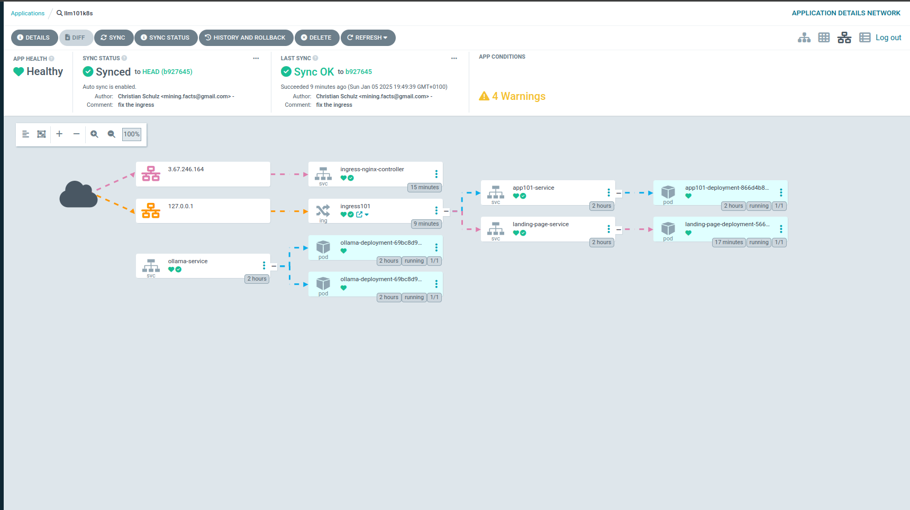
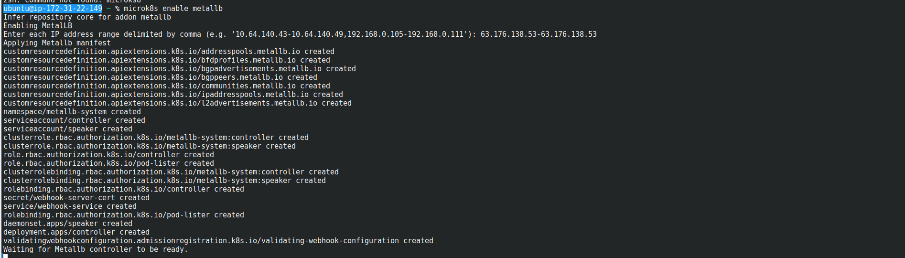
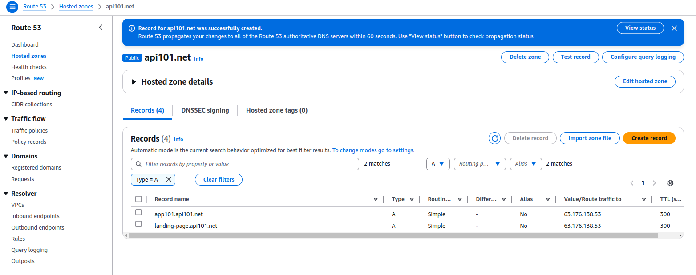

# MicroK8s for LLM- and other PoC's with https integration.



This is a detailed step-by-step guide to deploying a Kubernetes cluster with microk8s 
on a dedicated machine tailored for **proof-of-concept (PoC)** projects. The setup includes key components such as:

- **HTTPS Configuration**: Implemented using Cert-Manager with Let's Encrypt for real-world security and credibility.
- **Multi-Domain Ingress**: Supporting multiple applications or services under a single ingress controller.
- **Application Deployment**: Flexible setups using Dockerized applications, enabling support for various frameworks and languages.
- **Autoscaling**: Configured with Horizontal Pod Autoscalers (HPA) to handle variable workloads effectively.


---

## Table of Contents

- [MicroK8s for LLM- and other PoC's with https integration.](#microk8s-for-llm--and-other-pocs-with-https-integration)
  - [Table of Contents](#table-of-contents)
  - [0. Why This Approach?](#0-why-this-approach)
    - [A. Cost Efficiency](#a-cost-efficiency)
    - [B. Real HTTPS for Credibility](#b-real-https-for-credibility)
    - [C. Early Detection of Roadblocks](#c-early-detection-of-roadblocks)
    - [D. Flexibility with Frameworks and Languages](#d-flexibility-with-frameworks-and-languages)
    - [E. Showcasing Versatility](#e-showcasing-versatility)
  - [1. Prerequisites](#1-prerequisites)
  - [2. Setting Up the Kubernetes Cluster](#2-setting-up-the-kubernetes-cluster)
    - [On MicroK8s](#on-microk8s)
  - [3. Deploying the Ingress Controller](#3-deploying-the-ingress-controller)
  - [4. Configuring HTTPS with Cert-Manager](#4-configuring-https-with-cert-manager)
  - [5. Deploying Application and Service](#5-deploying-application-and-service)
  - [6. Add new **A records** in your domain registration](#6-add-new-a-records-in-your-domain-registration)
  - [6. Multi-Domain Ingress Configuration](#6-multi-domain-ingress-configuration)
  - [7. Using google-cloud notes.](#7-using-google-cloud-notes)
  - [8. Argocd](#8-argocd)
  - [9. Ollama](#9-ollama)

---


## 0. Why This Approach?

### A. Cost Efficiency
Using **MicroK8s** allows for a much cheaper alternative to hyperscalers (AWS, GCP, Azure) when running PoC projects. You avoid paying hourly or monthly fees for cloud-managed Kubernetes clusters while still benefiting from a full-featured Kubernetes environment on your local or on-premise setup. A decent dedicated 128 GB machine with a GPU is available for $150-200/month. On a hyperscaler you pay a multiple.

### B. Real HTTPS for Credibility
Having HTTPS configured using Cert-Manager with Let's Encrypt ensures that your projects are secure and showcase-ready. Many PoC projects fail to gain traction due to a lack of real-world deployment standards like HTTPS. This guide ensures that your Kubernetes setup is production-like, helping you demonstrate your work to stakeholders and users without compromising on best practices.

### C. Early Detection of Roadblocks
Deploying applications in a real Kubernetes cluster early in the development lifecycle helps identify potential issues, such as:
   - Configuration mismatches
   - Networking challenges
   - Resource scaling limitations

This proactive approach saves time and ensures that the transition from PoC to production is smoother.

### D. Flexibility with Frameworks and Languages
This guide leverages the Dockerized approach, enabling you to deploy applications built in different languages and frameworks. Whether you're using **Streamlit**, **Chainlit**, or any other technology, Kubernetes allows you to orchestrate and manage them efficiently. You can integrate tools built in Python, JavaScript, or any other language with ease.

### E. Showcasing Versatility
With multi-domain ingress and containerized deployments, you can run multiple independent PoC projects simultaneously on the same cluster. For instance:
   - A **Streamlit application** for data visualization
   - A **Chainlit based chatbot**
   - APIs or backend services written in Python, Node.js, or Go
This makes the setup ideal for teams working on diverse projects.


## 1. Prerequisites

Before starting, ensure you have the following:

- A Kubernetes cluster set up on either MicroK8s or GCP.
- Kubectl installed and configured to interact with your cluster.
- Administrative access to the cluster.
- Some experience with docker & k8s (kubectl) will help.

---

## 2. Setting Up the Kubernetes Cluster

### On MicroK8s
This steps are automatically executed by the infrastructure/ec2-setup.
So you can start with the manifests immediately.


1. Install microk8s:
   ```bash
   sudo snap install microk8s --classic
   sudo snap install kubectl  --classic
   ```

2. Start microk8s
   ```bash
   microk8s start && microk8s status
   ```

3. Enable essential add-ons (enable one at a time is best practice):
   You might need to use sudo.

   ```bash
   microk8s enable dns
   microk8s enable ingress
   microk8s enable storage
   ```

4. Use metallb as a builtin loadbalancer
   ```bash
   microk8s enable metallb
   ```
   

---

## 3. Deploying the Ingress Controller

Deploy the NGINX ingress controller to handle HTTP/HTTPS traffic.

```yaml
# ingress-nginx-controller.yaml
# sync wave helps to apply manifests in some order
# ingress-nginx-controller -> letsencrypt -> deployment/service -> ingress
apiVersion: v1
kind: Service
metadata:
  name: ingress-nginx-controller
  namespace: ingress
  annotations:
    argocd.argoproj.io/sync-wave: "-1"  # https://argo-cd.readthedocs.io/en/stable/user-guide/sync-waves/
spec:
  type: LoadBalancer
  ports:
    - name: http
      port: 80
      targetPort: 80
      protocol: TCP
    - name: https
      port: 443
      targetPort: 443
      protocol: TCP
  selector:
    name: nginx-ingress-microk8s
```

Apply the configuration:
```bash
kubectl apply -f ingress-controller-service.yaml
```

---

## 4. Configuring HTTPS with Cert-Manager

Cert-Manager automates certificate provisioning using Let's Encrypt.

1. Install Cert-Manager:
   ```bash
   kubectl apply -f https://github.com/jetstack/cert-manager/releases/download/v1.10.0/cert-manager.yaml
   ```

2. Create a Cluster Issuer:
   ```yaml
   # cluster-issuer-lets-encrypt.yaml
   apiVersion: cert-manager.io/v1
   kind: ClusterIssuer
   metadata:
     name: letsencrypt-dev
     namespace: default
     annotations:
      argocd.argoproj.io/sync-wave: "-1" 
   spec:
     acme:
       server: https://acme-v02.api.letsencrypt.org/directory
       email: your-email@example.com
       privateKeySecretRef:
         name: letsencrypt-dev
       solvers:
       - http01:
           ingress:
             class: nginx
   ```

   Apply the issuer:
   ```bash
   kubectl apply -f cluster-issuer.yaml
   ```

---

## 5. Deploying Application and Service

Here’s an example deployment configuration including the service accessed by the ingress.
Very important is not to forget to have the secret from your "registry" applied.

Access to the artifact registry in google cloud you get after create a secret with the credentials from a service-account you have set.
If your images are public , you don't need it.

```bash
kubectl create secret docker-registry gcr-json-key \                                               
    --docker-server=europe-west3-docker.pkg.dev \
    --docker-username=_json_key \
    --docker-password="$(cat credentials.json)" \
    --docker-email=you@mail.com
```


```yaml
# app101-deployment.yaml
apiVersion: apps/v1
kind: Deployment
metadata:
  name: app101-deployment
  namespace: default
spec:
  replicas: 1
  selector:
    matchLabels:
      app: app101
  template:
    metadata:
      labels:
        app: app101
    spec:
      containers:
        - name: app101
          image: your-docker-image:latest
          ports:
            - containerPort: 80
    imagePullSecrets:
      - name: gcr-json-key # Not necessary if your images are public.
---
apiVersion: v1
kind: Service
metadata:
  name: app101-service
  namespace: default
spec:
  selector:
    app: app101
  ports:
    - protocol: TCP
      port: 80
      targetPort: 80
  type: ClusterIP
```

---

## 6. Add new **A records** in your domain registration

I use AWS Route 53 for the domain, but it should be always similar simple.
Just add the dedicated IP with the intended subdomain.



---
## 6. Multi-Domain Ingress Configuration

Configure ingress rules for multiple domains:

```yaml
# ingress.yaml
apiVersion: networking.k8s.io/v1
kind: Ingress
metadata:
  name: multi-domain-ingress
  namespace: default
  annotations:
    kubernetes.io/ingress.class: "nginx"
    cert-manager.io/cluster-issuer: "letsencrypt-dev"
spec:
  tls:
    - hosts:
       - landing-page.api101.net  
       - app101.api101.net
        
      secretName: multi-domain-tls
  rules:
    - host: landing-page.api101.net
      http:
        paths:
          - path: /
            pathType: Prefix
            backend:
              service:
                name: landing-page-service
                port:
                  number: 80
    - host: app101.api101.net
      http:
        paths:
          - path: /
            pathType: Prefix
            backend:
              service:
                name: app101-service
                port:
                  number: 8501
```

Apply the ingress:
```bash
kubectl apply -f ingress.yaml
```
---

## 7. Using google-cloud notes.
The difference in using a cloud k8s cluster is instead of the 
microk8s commands you don't need the ingress-nginx-controller!

1. Create a GKE cluster with autoscaling:
   ```bash
   gcloud container clusters create my-cluster \
       --region=europe-west3 \
       --enable-autoscaling \
       --min-nodes=1 --max-nodes=3
   ```

2. Authenticate your local kubectl with the cluster:
   ```bash
   gcloud container clusters get-credentials my-cluster --region=europe-west3
   ```

---
## 8. Argocd

I'd like very much argocd and once you set this up you'll never miss it.
Please checkout https://argo-cd.readthedocs.io/en/stable/

Anyway here are some hints how to start it:

```bash
kubectl create namespace argocd
kubectl apply -n argocd -f https://raw.githubusercontent.com/argoproj/argo-cd/stable/manifests/install.yaml
kubectl patch svc argocd-server -n argocd -p '{"spec": {"type": "NodePort"}}'       
kubectl get svc -n argocd
# This is the first login password
kubectl -n argocd get secret argocd-initial-admin-secret -o jsonpath="{.data.password}" | base64 -d
```

Now you can access with the IP and the PORT the argocd gui.

```bash
kubectl get svc -n argocd
```

* In settings you need to setup your git repo.
* In applications you setup your project with the the repo from above.

If everything works out, it looks like the picture at the top.

---

## 9. Ollama

For ollama we have also a deployment, service and hpa for simplicity together in one file (see: [ollama-deployment.yaml](https://github.com/nnfuzzy/llm101-k8s/blob/main/infrastructure/manifests/ollama-deployment.yaml)).


Works without issues with a nvida gpu (microk8s enable nvidia)
For the pv you need to modify the NodeAffinity, if you use another StorageClass modify. Consider enough space for the models, too!
Stresstests are on my list.


The ollama-service has no models from the start, but with a job manifest it'll be handled automatically when the service is ready.

```yaml
# ollama-init-job.yaml
apiVersion: batch/v1
kind: Job
metadata:
  name: ollama-init-job
  namespace: default
spec:
  template:
    spec:
      containers:
      - name: post-install
        image: curlimages/curl:latest # Lightweight curl image
        command: ["/bin/sh", "-c"]
        args:
          - |
            echo "Waiting for the service to become available...";
            while ! nc -z ollama-service 11434; do sleep 1; done;
            echo "Service is available, sending requests...";
            curl http://ollama-service:11434/api/pull -d '{"model": "llama3.2:1b"}'
            curl http://ollama-service:11434/api/pull -d '{"model": "llama3.2:3b"}'
            echo "Requests completed.";
      restartPolicy: Never
  backoffLimit: 4The ollama-service has no models from the start, but with a job manifest it'll be handled automatically when the service is ready.
  ```